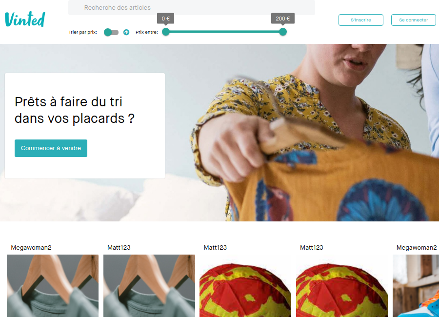

<h1 align="center"><project-name>Vinted replica</h1>

<project-description>This page replicates part of the Vinted website using React, Node, MongoDB, Stripe and Cloudinary.  Key features include:
<ul>
<li>Showing all available offers on the website</li>
<li>Ability to click on individual offers to go a detailed item screen</li>
<li>Searching for items by name and filtering by price using the integrated MUI bar</li>
<li>Ability to create a user account and upload items</li>
<li>Ability to pay for items using Stripe (test integration)</li></ul>

The data is stored in a Mongo Atlas database with user uploaded images hosted via Cloudinary.

## Links

- [Repo - front](https://github.com/Sekonda28/vinted-front "Repo")

- [Repo - back](https://github.com/Sekonda28/vinted-api "Repo")

- [Live](https://vinted-replica-mc.netlify.app/ "Live View")

- [API](https://vinted-api-matt.herokuapp.com/ "API")

## Screenshots

## Available Commands

In the project directory, you can run:

### `yarn start`

Runs the app in the development mode. 
Open [http://localhost:3000](http://localhost:3000) to view it in the browser.

The page will reload if you make edits. 
You will also see any lint errors in the console.

### `yarn test`

Launches the test runner in the interactive watch mode. 
See the section about [running tests](https://facebook.github.io/create-react-app/docs/running-tests) for more information.

### `yarn build`

Builds the app for production to the `build` folder. 
It correctly bundles React in production mode and optimizes the build for the best performance.

The build is minified and the filenames include the hashes. 
Your app is ready to be deployed!

See the section about [deployment](https://facebook.github.io/create-react-app/docs/deployment) for more information.

### `yarn eject`

**Note: this is a one-way operation. Once you `eject`, you can’t go back!**

If you aren’t satisfied with the build tool and configuration choices, you can `eject` at any time. This command will remove the single build dependency from your project.

Instead, it will copy all the configuration files and the transitive dependencies (webpack, Babel, ESLint, etc) right into your project so you have full control over them. All of the commands except `eject` will still work, but they will point to the copied scripts so you can tweak them. At this point you’re on your own.

You don’t have to ever use `eject`. The curated feature set is suitable for small and middle deployments, and you shouldn’t feel obligated to use this feature. However we understand that this tool wouldn’t be useful if you couldn’t customize it when you are ready for it.

## Built With

- React
- Node
- Yarn
- HTML
- CSS
- Stripe
- Material UI
- Cloudinary

## Future Updates

- Add responsive layout

## Author

**Matt Caswell**

- [Profile](https://github.com/Sekonda28 "Matt Caswell")
- [Email](mailto:matt.caswell@hotmail.com?subject=Hi "Hi!")
- [Website](https://sekonda28.github.io/MattCaswell-Portfolio "Welcome")

## 🤝 Support

Contributions, issues, and feature requests are welcome!

Give a ⭐️ if you like this project!
